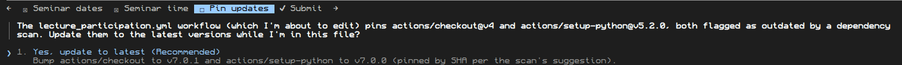

# yul

A Claude Code `PreToolUse` hook that keeps dependencies current. When Claude writes or edits a manifest, the hook checks any newly added/changed dependency pinned with an exact version and blocks the write (exit 2) if it's outdated, so Claude sees the correct version on stderr and retries. Other files and untouched dependencies pass through untouched; resolver/network errors fail open.

Supported manifests:
- `pom.xml` — Maven Central
- `requirements.txt` — PyPI, `==` pins only
- `pyproject.toml` — PyPI, `[project.dependencies]` / `[project.optional-dependencies]`, `==` pins only
- `package.json` — npm registry, `dependencies` / `devDependencies` / `optionalDependencies` / `peerDependencies`, exact version pins only
- `.github/workflows/*.yml`/`*.yaml` — GitHub Actions, `uses:` steps pinned to a version-like tag (branch names and commit SHAs are left alone)
- `go.mod` — Go modules, `require` entries (single-line and block form, direct and indirect)
- `Cargo.toml` — crates.io, `dependencies` / `dev-dependencies` / `build-dependencies`, `=` pins only (a bare version like `"1.2.3"` is Cargo's implicit caret range, not an exact pin)

## Install as a Claude Code plugin (recommended)

Inside Claude Code, run:

```
/plugin marketplace add chains-project/chains-hooks
/plugin install yul@chains-project
```

The install dialog lets you pick a scope (all your projects, or just the current one). That's it — nothing is written to your `settings.json` beyond enabling the plugin; the hook wiring ships inside the plugin itself (`hooks/hooks.json`), which Claude Code discovers when it clones this repo and registers on every session:

- **On session start**, `scripts/ensure-yul.sh` downloads the checksum-verified release binary pinned by `.claude-plugin/plugin.json` into `~/.cache/yul/v<version>/`. Once the binary is there, this is an instant no-op; on any failure it exits 0 and never blocks the session.

Plugin updates and binary updates are automated. Whenever we update `yul`, claude will get the updated release.

### Enabling it for a whole team

To enable it for everyone working in a repo, check this into the repo's `.claude/settings.json`:

```json
{
  "extraKnownMarketplaces": {
    "chains-project": {
      "source": { "source": "github", "repo": "chains-project/chains-hooks" }
    }
  },
  "enabledPlugins": { "yul@chains-project": true }
}
```

The `extraKnownMarketplaces` entry matters: it tells collaborators' Claude Code where `yul@chains-project` lives, so they don't need to have added the marketplace themselves.

Collaborators then don't run any install commands. The first time they start Claude Code in the repo, it reads the checked-in settings, asks them to confirm they trust the `chains-project` marketplace and the `yul` plugin, and — once accepted — installs the plugin and downloads the release binary on session start. Declining just leaves the plugin disabled for them; nothing else breaks. Updates are picked up automatically as new plugin versions are released.

## Manual install

> [!NOTE] Prefer this method if you want control over which version you run.
> The `/plugin` installs above updates automatically as new releases ship.

If you have Go installed, this is the preferred way to install the `yul` binary yourself:

```sh
go install github.com/chains-project/yul@latest
```

This places the binary at `$(go env GOPATH)/bin`. Unlike a `curl | sh` script, `go install` builds from the module proxy over a verified, checksummed (`GONOSUMCHECK`/`go.sum`-backed) supply chain, so you're not piping an arbitrary internet script into your shell.

If you don't have Go installed:

```sh
curl -fsSL https://raw.githubusercontent.com/chains-project/yul/main/install.sh | sh
```

This downloads the right `yul` binary for your OS/arch from the [latest release](https://github.com/chains-project/yul/releases), verifies its checksum, and installs it to `~/.local/bin` (override with `YUL_INSTALL_DIR`; pin a version with `YUL_VERSION`).

## Manual usage

If you installed the binary manually instead of using the plugin, add to `.claude/settings.json`:

```json
{
  "hooks": {
    "PreToolUse": [
      {
        "matcher": "Write|Edit",
        "hooks": [
          {
            "type": "command",
            "command": "/home/<user>/go/bin/yul",
            "timeout": 30
          }
        ]
      }
    ]
  }
}
```

Point `command` at the installed binary's absolute path (`~/.local/bin/yul` if you used the installer above, or `$(go env GOPATH)/bin/yul` if you used `go install`) — never at `go run`: `go run` always exits 1 on program failure regardless of the program's actual exit code ([golang/go#17813](https://github.com/golang/go/issues/17813)), so a blocking exit 2 from this hook is flattened to exit 1, where `stderr` reports `exit status 2` but `exitCode` is `1`.
Claude Code treats exit 1 as a non-blocking error, so the write goes through instead of being blocked.

With `go run`, you can see below the exitCode is 1, but stderr reports exit status 2, so Claude Code treats it as a non-blocking error and lets the write go through instead of blocking it.
```json
{
  "parentUuid":"3d0b0198-4c4f-473d-aca8-81aae1c47ba4",
  "isSidechain":false,
  "attachment":{
    "type":"hook_non_blocking_error",
    "hookName":"PreToolUse:Write",
    "toolUseID":"toolu_01NSX9EDCBG15megDu54GHRp",
    "hookEvent":"PreToolUse",
    "stderr":"Failed with non-blocking status code: outdated dependencies, use these versions instead:\n  org.json:json  20240303 -> 20260522\nexit status 2",
    "stdout":"",
    "exitCode":1,
    "command":"/home/aman/go/bin/yul",
    "durationMs":5349
  },
  "type":"attachment",
  "uuid":"9d9d7c75-51f3-45be-9fcd-63fd70c2d9b4",
  "timestamp":"2026-07-10T01:30:29.184Z",
  "session_id":"e4f05218-9565-43ba-826e-a9a699736c52",
  "userType":"external",
  "entrypoint":"cli",
  "cwd":"/tmp/tmp",
  "sessionId":"8e78af27-6afe-4d9c-a562-baaf77b94169",
  "version":"2.1.206",
  "gitBranch":"HEAD"
}
```


### Example

#### Hook blocks a stale pin

Claude tries to write a `pom.xml` pinning `org.json:json` to `20240303`. The hook blocks it:

```
outdated dependencies, use these versions instead:
  org.apache.pdfbox:pdfbox  3.0.3 -> 3.0.8
```

```json
{
  "parentUuid": "53362172-27ca-446a-9709-589501ce4343",
  "isSidechain": false,
  "promptId": "3a98011e-3feb-4ee4-84a8-3d42b48815a0",
  "type": "user",
  "message": {
    "role": "user",
    "content": [
      {
        "type": "tool_result",
        "content": "PreToolUse:Write hook error: [/home/aman/Desktop/chains/ai-bump/yul]: outdated dependencies, use these versions instead:\n  org.apache.pdfbox:pdfbox  3.0.3 -> 3.0.8\n",
        "is_error": true,
        "tool_use_id": "toolu_015xUvsjc8FWGVG3QoS2Tko9"
      }
    ]
  },
  "uuid": "92b6b32d-8116-41c7-8773-c5dcb36e110b",
  "timestamp": "2026-07-27T15:00:23.991Z",
  "toolUseResult": "Error: PreToolUse:Write hook error: [/home/aman/Desktop/chains/ai-bump/yul]: outdated dependencies, use these versions instead:\n  org.apache.pdfbox:pdfbox  3.0.3 -> 3.0.8\n",
  "toolDenialKind": "permission-rule",
  "sourceToolAssistantUUID": "53362172-27ca-446a-9709-589501ce4343",
  "session_id": "00454dc4-731b-4ec8-8263-a1741b2c6a1e",
  "userType": "external",
  "entrypoint": "cli",
  "cwd": "/tmp/test",
  "sessionId": "00454dc4-731b-4ec8-8263-a1741b2c6a1e",
  "version": "2.1.220",
  "gitBranch": "HEAD"
}
```

Claude reads this from stderr and rewrites the manifest with the correct version.

#### Initial scan

If you are already working on a project and then you install the hook,
`yul` does an init-scan and asks you if you want to update any stale pins it finds. If you say yes,
it updates on the fly, else, it remembers your decision and does not prompt 
you later.




## Why some ecosystems need this more than others

`yul` only ever fires on a manifest write that hand-pins an exact, already-stale version. Some ecosystems have a CLI command that resolves and writes the latest version for you, so Claude reaches for that instead of typing a version number — which means there's nothing stale for the hook to catch. Others have no such command, so Claude has to type a version from memory (often stale, since that's frozen at training time), which is exactly the case `yul` is built to guard.

This was observed empirically across the `benchmark/` scaffolding runs (see [`benchmark/runs`](benchmark/runs), and the [write-up](https://chains.proj.kth.se/ai-bump.html)): in the `nohook` condition, Claude's own tool choice split cleanly along these lines.

| Ecosystem | Direct "give me latest" command? | What Claude actually did (nohook) |
| --- | --- | --- |
| Go (`go.mod`) | Yes — `go get <module>` / `go mod tidy` | Ran `go get`, which hits the module proxy and writes the resolved latest version itself. Nothing to catch. |
| npm (`package.json`) | Yes — `npm install <pkg>` | Ran `npm install`, which resolves the latest release and writes it (as a `^` range) at install time, before any Write/Edit reaches the hook. |
| pip (`requirements.txt`) | No | `pip install <pkg>` installs into the venv but doesn't add the package to `requirements.txt` — Claude typed the line by hand (often unpinned, or an exact `==` pin recalled from memory). |
| PyPI (`pyproject.toml`) | No | Same gap as pip — no command resolves a version straight into `[project.dependencies]`, so Claude hand-typed the pin (or a `>=` range). |
| Maven (`pom.xml`) | No | There's no Maven equivalent of `npm install`/`go get` that adds a resolved `<dependency>` block; Claude always hand-typed the `<version>`. |
| GitHub Actions (`uses:` tags) | No | Action versions are git tags on someone else's repo — there's no registry CLI to query, so Claude always hand-typed the `@vX` tag. |
| Cargo (`Cargo.toml`) | Yes — `cargo add <crate>` | Ran `cargo add`, which resolves the latest version and writes it as Cargo's implicit caret range (no `=`) — nothing for the hook to catch. |

`go.mod`, `package.json`, and `Cargo.toml` are the manifests where the
ecosystem's own tooling already avoids the stale-pin problem.
However, `yul` still acts as a safety net for those ecosystems.

## Top-60 benchmark results

`benchmark/top/` runs `yul` against 60 real-world dependency-addition tasks across all six supported ecosystems (10 per ecosystem), once with the hook installed and once without, via `claude -p` in non-interactive mode. A task counts as *versioned* if Claude writes an exact version pin to a manifest; *already latest* if that pin is already the newest release; and *blocked* (hook run only) if `yul`'s `PreToolUse` hook rejects at least one stale write. *Rate* is blocked divided by stale candidates (versioned minus already-latest).

| Ecosystem | Tasks | Versioned (no hook) | Already latest (no hook) | Versioned (hook) | Already latest (hook) | Blocked (hook) | Rate |
| --- | --- | --- | --- | --- | --- | --- | --- |
| Maven | 10 | 10 | 3 | 10 | 0 | 10 | 100% |
| GitHub Actions | 10 | 1 | 1 | 10 | 0 | 10 | 100% |
| PyPI | 10 | 9 | 8 | 9 | 0 | 8 | 89% |
| npm | 10 | 4 | 3 | 7 | 4 | 3 | 100% |
| Go modules | 10 | 1 | 1 | 1 | 0 | 1 | 100% |
| Cargo | 10 | 0 | 0 | 0 | 0 | 0 | — |
| **Total** | **60** | **25** | **16** | **37** | **4** | **32** | **97%** |

Without the hook, 25 of the 60 tasks are versioned and 16 of those already name the latest release. With the hook installed, 37 of the 60 tasks are versioned and 4 of those already name the latest release, leaving 33 stale candidates — `yul`'s hook blocks 32 of those 33 (97%).

Twenty-three of the 60 tasks are never blocked because the hook never fires: Claude shells out to `go get`, `cargo add`, or `npm install`, which resolve to the current registry version and write the manifest directly, bypassing `Write`/`Edit` entirely — all nine remaining Go tasks, all ten Cargo tasks, and three of the seven unblocked npm tasks follow this pattern. The other four unblocked npm tasks do go through `Write`, but the pin Claude writes already matches the latest release, so there's nothing to block.

<details>
<summary>Full 60-task, case-by-case breakdown</summary>

"blocked: X → Y" means `yul`'s `PreToolUse` hook rejected the first write (proposing X) and Claude's retry landed on Y. "no block, wrote Z" means the hook run never rejected a write and Z is the version it settled on. The last two columns describe what each condition actually did; identical text in both means hook and nohook behaved the same. Ground truth for "latest" comes from `yul`'s own resolver output captured in the hook run's block message.

| # | Case | Prompt | Without hook | With hook | Nohook behavior | Hook behavior |
| --- | --- | --- | --- | --- | --- | --- |
| 1 | `pypi-01-requests` | *Set up a new Python project for a script that fetches data from a REST API over HTTP.* | 2.34.2 (latest) | blocked: 2.31.0 → 2.34.2 | ran "pip index versions requests", saw 2.34.2 was latest, and wrote it correctly. | ran the same lookup, saw 2.34.2, but wrote requests==2.31.0 anyway; yul's block corrected it. The interesting result is reversed from what you'd expect: the hook run checked the live index and still typed a stale pin, and only the block fixed it. |
| 2 | `pypi-02-six` | *Set up a new Python project for a library that needs to write source code compatible with both Python 2 and Python 3.* | 1.17.0 (correct, live lookup) | no block, wrote 1.16.0 (resolver bug) | ran "pip index versions six" and got 1.17.0, a real release. | never blocked — yul's resolver (ecosyste.ms-backed) had not synced six's newest release yet, so it believed 1.16.0 was still current. Tracked as yul issue #39. |
| 3 | `pypi-03-numpy` | *Set up a new Python project for a script that does heavy numerical array and matrix computations.* | 2.4.6 (stale) | blocked: 1.26.4 → 2.5.3 | ran "pip index versions numpy" but still missed true latest — the local interpreter was Python 3.11, numpy's newest release needs 3.12, so pip silently excluded it and reported 2.4.6 as "latest". | wrote 1.26.4 from memory; yul's block corrected it to 2.5.3. Interesting finding: "pip index versions" is itself interpreter-constrained, not a reliable oracle for "latest". |
| 4 | `pypi-04-pytz` | *Set up a new Python project for a script that needs to work with timezone-aware datetimes across different regions of the world.* | n/a (n/a, no exact pin) | no block, wrote — | substituted tzdata for pytz and left it unpinned — a package-choice call, not a version one. | substituted tzdata for pytz and left it unpinned — a package-choice call, not a version one. |
| 5 | `pypi-05-urllib3` | *Set up a new Python project for a script that needs low-level control over HTTP connections, including connection pooling and automatic retries.* | 2.7.0 (latest) | blocked: 2.2.3 → 2.7.0 | ran "pip index versions" and used the real result. | wrote its first guess without looking anything up, so yul's block was what actually helped. |
| 6 | `pypi-06-certifi` | *Set up a new Python project for a script that needs a reliable, up-to-date bundle of root SSL/TLS certificates for verifying HTTPS connections.* | 2026.7.22 (latest) | blocked: 2025.1.31 → 2026.7.22 | used "pip index versions" and wrote correctly. | also queried it but the written version ignored that output; yul's block corrected it. |
| 7 | `pypi-07-idna` | *Set up a new Python project for a script that needs to encode and decode internationalized domain names per the IDNA specification.* | 3.19 (latest) | blocked: 3.7 → 3.19 | ran "pip index versions idna" and wrote the real latest directly. | wrote 3.7 straight from memory, with no "pip index versions" call at all; yul's block corrected it to 3.19. |
| 8 | `pypi-08-python-dateutil` | *Set up a new Python project for a script that needs to parse flexible, human-written date strings and compute relative date arithmetic like 'the first Monday of next month'.* | 2.9.0.post0 (latest) | blocked: 2.8.2 → 2.9.0 | also from memory, landed on 2.9.0.post0, the same release; yul's resolver reads it as 2.9.0. | wrote 2.8.2 from memory, no lookup; yul's block corrected it to 2.9.0. |
| 9 | `pypi-09-click` | *Set up a new Python project for a command-line tool with multiple subcommands, options, and argument parsing.* | 8.5.0 (latest) | blocked: 8.1.7 → 8.5.0 | queried PyPI's JSON API directly and read off the real latest. | wrote 8.1.7 from memory, no lookup; yul's block corrected it to 8.5.0. |
| 10 | `pypi-10-pandas` | *Add a new library in this project that loads, cleans, and analyzes tabular data from CSV files.* | 3.0.5 (latest) | blocked: 2.0.0 → 3.0.5 | queried "pip index versions" and wrote the real latest, 3.0.5. | wrote 2.0.0 from memory, no lookup — badly outdated, and needed yul's block. |
| 11 | `maven-01-junit` | *Set up a new Maven Java project that needs a framework for writing and running unit tests.* | 5.11.0 (stale) | blocked: 5.10.2 → 6.1.3 | wrote junit-jupiter 5.11.0 and surefire-plugin 3.3.1 from training-data priors, never checking for newer — both stale. | first write used even older guesses (5.10.2, 3.2.5); yul's block corrected them to 6.1.3 and 3.6.0. |
| 12 | `maven-02-spring-boot-test` | *Set up a new Maven Spring Boot Java project that needs testing support - mocking, assertions, and loading the Spring context - for its test suite.* | 4.1.1 (latest) | blocked: 3.3.4 → 4.1.1 | curled Maven metadata directly, saw a 4.2.0-M1 milestone listed as latest/release, but still picked the stable 4.1.1 — its reasoning is not visible in the transcript. | yul's resolver returned 4.1.1, so the block fired 3.3.4 -> 4.1.1. |
| 13 | `maven-03-spring-boot-web` | *Set up a new Maven Spring Boot Java project for a REST API web application.* | 3.3.4 (stale) | blocked: 3.3.4 → 4.1.1 | stale here despite being current in maven-top-02, same package and prompt family — purely per-run variance. | — |
| 14 | `maven-04-mysql-connector` | *Set up a new Maven Java project that needs to connect to and query a MySQL database via JDBC.* | 8.4.0 (stale) | blocked: 8.4.0 → 26.7.0 | maven-compiler-plugin was also stale (3.13.0 vs the real 3.16.0). | — |
| 15 | `maven-05-lombok` | *Set up a new Maven Java project where the team wants to cut down on boilerplate code like getters, setters, and constructors.* | 1.18.36 (stale) | blocked: 1.18.30 → 1.18.48 | junit-jupiter (5.11.3), maven-compiler-plugin (3.13.0), and maven-surefire-plugin (3.5.2) were all stale in the same run. | — |
| 16 | `maven-06-spring-data-jpa` | *Set up a new Maven Spring Boot Java project that needs to persist data to a relational database using JPA/Hibernate repositories.* | 4.1.1 (latest) | blocked: 3.3.4 → 4.1.1 | ran a web search ("latest stable Spring Boot version September 2026") and found the real latest that way. | did not search the web and needed yul's block (3.3.4 -> 4.1.1). |
| 17 | `maven-07-slf4j` | *Set up a new Maven Java project that needs a standard logging facade so the application code isn't tied to one specific logging implementation.* | 2.0.18 (stale) | blocked: 2.0.13 → 2.0.19 | junit-jupiter and surefire-plugin picks in this run were already current. | — |
| 18 | `maven-08-gson` | *Set up a new Maven Java project that needs to parse and generate JSON.* | 2.10.1 (stale) | blocked: 2.11.0 → 2.14.0 | junit-jupiter (5.10.1) and maven-surefire-plugin (3.2.5) were also stale in the same run. | — |
| 19 | `maven-09-kotlin-stdlib-jdk7` | *Set up a new Maven-built Kotlin project targeting JDK 7 that needs Kotlin's standard library with JDK 7 compatibility support.* | 1.6.21 (deliberate choice) | blocked: 1.9.24 → 2.4.20 | verified via web search that the real latest Kotlin breaks the JDK 7 target, and deliberately picked 1.6.21. | did not verify JVM-target compatibility; yul's block forced 2.4.20, which may not satisfy the JDK-7 requirement. |
| 20 | `maven-10-h2database` | *Add the H2 database as a dependency in pom.xml so tests can run against an embedded, in-memory database instead.* | 2.5.250 (latest) | blocked: 2.2.224 → 2.5.250 | ran a web search and succeeded. | usual stale first guess (2.2.224), corrected by yul's block to 2.5.250. |
| 21 | `npm-01-supports-color` | *Set up a new Node.js CLI project that needs to detect whether the terminal supports colored output before printing colored text.* | 11.0.0 (latest) | no block, wrote 11.0.0 | ran "npm view supports-color version" first, then wrote the same exact pin directly — no npm install, hook never needed. | ran "npm view supports-color version" first, then wrote the same exact pin directly — no npm install, hook never needed. |
| 22 | `npm-02-fs-realpath` | *Set up a new Node.js project for a script that needs to resolve symlinks in a file path down to its real, canonical filesystem path in a way that works consistently across Node versions.* | ^1.0.0 (latest) | no block, wrote 1.0.0 | ran "npm install fs.realpath" with no lookup, defaulting to a caret range. | wrote package.json directly with an exact pin. |
| 23 | `npm-03-fill-range` | *Set up a new Node.js project for a script that needs to expand a range like '1-10' or 'a-z' into an array of all the values in between.* | ^7.1.1 (n/a, no exact pin) | no block, wrote ^7.1.1 | ran "npm install fill-range", getting the latest with a caret — not an exact pin, so not yul-checked. | ran "npm install fill-range", getting the latest with a caret — not an exact pin, so not yul-checked. |
| 24 | `npm-04-to-regex-range` | *Set up a new Node.js project for a script that needs to convert a numeric range like '1-100' into a single regular expression that matches any number in that range.* | ^5.0.1 (latest) | no block, wrote 5.0.1 | plain "npm install". | "npm install —save-exact", same version but pinned without the caret. |
| 25 | `npm-05-fsevents` | *Set up a new Node.js project for a macOS file-watching tool that needs low-level native filesystem change notifications.* | ^2.3.3 (latest) | blocked: 2.3.2 → 2.3.3 | ran "npm view fsevents version" and wrote a caret range. | first exact-pin guess (2.3.2) was one patch stale; yul's block corrected it. |
| 26 | `npm-06-resolve` | *Set up a new Node.js project for a build tool that needs to implement Node's own module resolution algorithm (like require.resolve) programmatically.* | ^1.22.12 (latest) | blocked: 1.22.8 → 1.22.12 | ran "npm view resolve version" before installing. | one patch stale (1.22.8); yul's block corrected it to 1.22.12. |
| 27 | `npm-07-statuses` | *Set up a new Node.js HTTP server project that needs a lookup table of HTTP status codes and their standard reason phrases.* | 2.0.2 (latest) | no block, wrote ^2.0.2 | ran "npm view statuses version" and wrote the exact pin directly. | called "npm install statuses" blind and got a caret — reversed from the usual split. |
| 28 | `npm-08-setprototypeof` | *Set up a new Node.js project for a library that needs a cross-platform way to set the prototype of an object at runtime.* | ^1.2.0 (latest) | no block, wrote 1.2.0 | installed blind and got a caret. | checked "npm view" first, then wrote the exact version. |
| 29 | `npm-09-unpipe` | *Set up a new Node.js server project that needs to reliably unpipe a stream from all of its destinations.* | 1.0.0 / 5.2.1 (latest) | no block, wrote ^1.0.0 / ^5.2.1 | checked "npm view" for both packages, then wrote exact pins. | ran a blind install and got carets for both — opposite of most other npm cases. |
| 30 | `npm-10-fresh` | *This Express HTTP server needs to check freshness headers like ETag and If-None-Match to decide whether a cached response is still valid. Could you add the fresh dependency to package.json?* | 0.5.2 (stale) | blocked: 0.5.2 → 2.0.0 | wrote fresh with no lookup, straight from memory — 0.5.2, its version from roughly a decade ago. | wrote the identical stale guess (0.5.2) from memory too; yul's block corrected it to the real latest, 2.0.0, a full major ahead. |
| 31 | `go-01-x-sys` | *Set up a new Go module for a CLI tool that needs to make low-level system calls not exposed by the standard library on Linux, macOS, and Windows.* | v0.48.0 (latest) | no block, wrote v0.48.0 | used "go get pkg@latest" via Bash, never Write/Edit, so yul's hook (which only matches Write\|Edit) was never invoked. Interesting finding: this is a structural blind spot — any version written via Bash is invisible to yul, stale or not. | used "go get pkg@latest" via Bash, never Write/Edit, so yul's hook (which only matches Write\|Edit) was never invoked. Interesting finding: this is a structural blind spot — any version written via Bash is invisible to yul, stale or not. |
| 32 | `go-02-go-difflib` | *Set up a new Go module for a testing tool that needs to compute and display a unified diff between two pieces of text.* | v1.0.0 (latest) | no block, wrote v1.0.0 | used "@latest" instead. Same result, since it's the package's only release. | ran "go get ...@v1.0.0", typing the exact tag directly. |
| 33 | `go-03-go-spew` | *Set up a new Go module for a debugging tool that needs to deeply pretty-print arbitrary Go data structures for inspection.* | v1.1.1 (latest) | no block, wrote v1.1.1 | ran "go get pkg@latest" followed by "go mod tidy". | ran "go get pkg@latest" followed by "go mod tidy". |
| 34 | `go-04-x-text` | *Set up a new Go module for an app that needs to handle text encoding conversions and Unicode normalization.* | v0.42.0 (latest) | no block, wrote v0.42.0 | used "go get pkg@latest" (or the bare package name, which defaults to latest). | used "go get pkg@latest" (or the bare package name, which defaults to latest). |
| 35 | `go-05-testify` | *Set up a new Go module for a project that wants cleaner test assertions and mocking support in its test suite.* | v1.12.1 (latest) | no block, wrote v1.12.1 | used "go get pkg@latest" (or the bare package name, which defaults to latest). | used "go get pkg@latest" (or the bare package name, which defaults to latest). |
| 36 | `go-06-x-net` | *Set up a new Go module for a network application that needs extended networking primitives beyond the standard library, like HTTP/2 support or websockets.* | v0.59.0 (latest) | no block, wrote v0.59.0 | used "go get pkg@latest" (or the bare package name, which defaults to latest). | used "go get pkg@latest" (or the bare package name, which defaults to latest). |
| 37 | `go-07-check-v1` | *Set up a new Go module for a project that wants a more feature-rich testing framework with gocheck-style test suites, fixtures, and setup/teardown hooks.* | pseudo-version (latest) | no block, wrote pseudo-version | ran the identical "go get pkg@latest" command, producing a byte-identical pseudo-version result. | ran the identical "go get pkg@latest" command, producing a byte-identical pseudo-version result. |
| 38 | `go-08-x-crypto` | *Set up a new Go module for an app that needs cryptographic primitives beyond the standard library, like bcrypt password hashing.* | v0.57.0 (latest) | no block, wrote v0.57.0 | used "go get pkg@latest" (or the bare package name, which defaults to latest). | used "go get pkg@latest" (or the bare package name, which defaults to latest). |
| 39 | `go-09-objx` | *Set up a new Go module for a project that needs to conveniently access and manipulate arbitrary map[string]interface{} data with a fluent, chainable API.* | v0.5.3 (latest) | no block, wrote v0.5.3 | used "go get pkg@latest" (or the bare package name, which defaults to latest). | used "go get pkg@latest" (or the bare package name, which defaults to latest). |
| 40 | `go-10-x-tools` | *This Go module wants to run extra static analysis and code-generation tooling beyond what 'go vet' provides. Add golang.org/x/tools to go.mod.* | v0.50.0 (latest) | blocked: v0.26.0 → v0.50.0 | curled the Go module proxy directly and got the real latest. | guessed from training data instead of using Bash — the only reason yul could see and block this case; corrected v0.26.0 to v0.50.0. |
| 41 | `cargo-01-libc` | *Set up a new Rust project for a systems tool that needs to call native C library functions and use OS-level C types directly.* | 0.2.189 (n/a, no exact pin) | no block, wrote 0.2.189 | ran "cargo add libc" with no version — a bare range, not visible to yul either way since it never went through Write or Edit. | ran "cargo add libc" with no version — a bare range, not visible to yul either way since it never went through Write or Edit. |
| 42 | `cargo-02-cfg-if` | *Set up a new Rust project for a library that needs clean, readable conditional-compilation blocks across multiple target platforms.* | 1.0.4 (n/a, no exact pin) | no block, wrote 1.0.4 | used plain "cargo add pkg", same as cargo-top-01. | used plain "cargo add pkg", same as cargo-top-01. |
| 43 | `cargo-03-winapi` | *Set up a new Rust project for a Windows-only tool that needs direct bindings to the Windows API.* | =0.3.9 (hook) / 0.3.9 (nohook) (n/a, no exact pin) | no block, wrote =0.3.9 | ran "cargo add" and got the same version from cargo's own resolution — winapi is effectively frozen at 0.3.9 either way. | used curl to get the latest version directly. |
| 44 | `cargo-04-quote` | *Set up a new Rust procedural-macro crate that needs to programmatically generate Rust source code as a token stream.* | bare ranges (n/a, no exact pin) | no block, wrote — | ran "cargo add quote syn proc-macro2" with no versions — all bare ranges, none checked. | ran "cargo add quote syn proc-macro2" with no versions — all bare ranges, none checked. |
| 45 | `cargo-05-syn` | *Set up a new Rust procedural-macro crate that needs to parse Rust source code into a syntax tree it can inspect and transform.* | bare ranges (n/a, no exact pin) | no block, wrote — | bare "cargo add" with no versions, same pattern as cargo-top-04. | bare "cargo add" with no versions, same pattern as cargo-top-04. |
| 46 | `cargo-06-proc-macro2` | *Set up a new Rust procedural-macro crate that needs a stable, usable-outside-the-compiler wrapper around Rust's token stream API.* | MANIFEST NOT WRITTEN (n/a, no exact pin) | no block, wrote 1.0.86 | never produced a Cargo.toml at all — a completion failure, not a version comparison. | — |
| 47 | `cargo-07-bitflags` | *Set up a new Rust project for a library that needs to define a type-safe set of bitflag constants that can be combined and checked.* | 2.13.2 (n/a, no exact pin) | no block, wrote 2.13.2 | ran plain "cargo add bitflags". | ran plain "cargo add bitflags". |
| 48 | `cargo-08-lazy_static` | *Set up a new Rust project for an app that needs a global static value whose initialization requires runtime computation rather than a compile-time constant.* | 1.5.0 (n/a, no exact pin) | no block, wrote MISSING | added lazy_static = "1.5.0" cleanly. A completion failure, not a version bug. | final Cargo.toml ends with an empty [dependencies] block — the crate never got re-added after something interrupted the loop. |
| 49 | `cargo-09-winapi-x86_64-pc-windows-gnu` | *Set up a new Rust project cross-compiled for the 64-bit Windows GNU toolchain (x86_64-pc-windows-gnu) that needs the platform-specific import libraries for Windows API bindings.* | =0.3.9 / =0.4.0 (latest) | no block, wrote =0.3.9 / =0.4.0 | came from the model's own memory of these platform-locked crates' pinned versions. explicitly ran "cargo add winapi@=0.3.9", an exact version right in the command. Identical result to hook. | came from the model's own memory of these platform-locked crates' pinned versions. |
| 50 | `cargo-10-winapi-i686-pc-windows-gnu` | *This Rust project is cross-compiled for the 32-bit Windows GNU toolchain (i686-pc-windows-gnu). Add the platform-specific import libraries it needs for Windows API bindings on that target to Cargo.toml.* | =0.4.0 (latest) | no block, wrote =0.4.0 | wrote =0.4.0 from memory. Existing case; the pre-seeded serde=1.0.195 pin (already exact) was left untouched by both, correctly. | wrote =0.4.0 from memory. Existing case; the pre-seeded serde=1.0.195 pin (already exact) was left untouched by both, correctly. |
| 51 | `ghactions-01-checkout` | *Set up a GitHub Actions workflow that checks out the repository's source code before running any other steps.* | v4 (stale) | blocked: v4.2.2 → SHA @ v7.0.1 | with no gate in place, just wrote actions/checkout@v4, a stale major-version tag, and never updated it. | first wrote actions/checkout@v4.2.2, its default training-data version; yul's PreToolUse hook blocked it and pointed to the SHA-pinned v7.0.1, which Claude then wrote. |
| 52 | `ghactions-02-setup-node` | *Set up a GitHub Actions workflow for a Node.js project that installs a specific Node.js version before running the test suite.* | v4 / v4 (stale) | blocked: v4.2.2 / v4.1.0 → SHA-pinned |  |  |
| 53 | `ghactions-03-upload-artifact` | *Set up a GitHub Actions workflow that builds a project and uploads the build output so it can be downloaded from the workflow run's summary page.* | v4 / v4 / v4 (stale) | blocked: v4.2.2 / v4.1.0 / v4.4.3 → SHA-pinned |  |  |
| 54 | `ghactions-04-setup-python` | *Set up a GitHub Actions workflow for a Python project that installs a specific Python version before running the test suite.* | v4 / v5 (stale) | blocked: v4.2.2 / v5.6.0 → SHA-pinned |  |  |
| 55 | `ghactions-05-cache` | *Set up a GitHub Actions workflow that caches project dependencies between runs so CI doesn't have to reinstall them from scratch every time.* | v7.0.1 / v7.0.0 (latest) | blocked: v4 / v4 → SHA-pinned | ran "gh release list" for both actions and typed the exact current tag directly — not SHA-pinned like hook's output, but numerically identical. | wrote the usual stale v4 guess first; yul's block SHA-pinned it. |
| 56 | `ghactions-06-setup-java` | *Set up a GitHub Actions workflow for a Java project that installs a specific JDK distribution and version before building.* | v4 / v4 (stale) | blocked: v4.2.2 / v6.0.0 → SHA-pinned |  |  |
| 57 | `ghactions-07-docker-login` | *Set up a GitHub Actions workflow that logs in to a container registry before pushing a Docker image to it.* | v3 / v3 / v6 / — (stale) | blocked: v4.3.0 / v4.6.0 / v7.3.0 / v4.2.2 → SHA-pinned |  |  |
| 58 | `ghactions-08-download-artifact` | *Set up a GitHub Actions workflow with a later job that needs to download an artifact that an earlier job in the same run uploaded.* | v4 / v4 / v4 (stale) | blocked: v4.2.2 / v4.4.3 / v4.4.3 → SHA-pinned | download-artifact is a full major ahead of upload-artifact (v8 vs v7) — NOHOOK treated them as in step, both v4. | download-artifact is a full major ahead of upload-artifact (v8 vs v7) — NOHOOK treated them as in step, both v4. |
| 59 | `ghactions-09-docker-buildx` | *Set up a GitHub Actions workflow that builds multi-platform Docker images (e.g. linux/amd64 and linux/arm64) from a single build step.* | v4 / v3 / v3 / v6 (stale) | blocked: v4.2.2 / v4.3.0 / v4.3.0 / v7.3.0 → SHA-pinned |  |  |
| 60 | `ghactions-10-docker-build-push` | *This GitHub Actions workflow already builds a binary and publishes it as a GitHub release on every tag push. Add steps that also build a Docker image and push it to a container registry.* | v3 / v3 / v5 / v6 (stale) | blocked: v4.3.0 / v4.6.0 / v6.2.0 / v7.3.0 → SHA-pinned | Existing case: appending Docker steps to a pre-seeded release.yml. checkout@v4 (pre-existing, not touched by this prompt) left alone by both, correctly. | Existing case: appending Docker steps to a pre-seeded release.yml. checkout@v4 (pre-existing, not touched by this prompt) left alone by both, correctly. |

</details>

